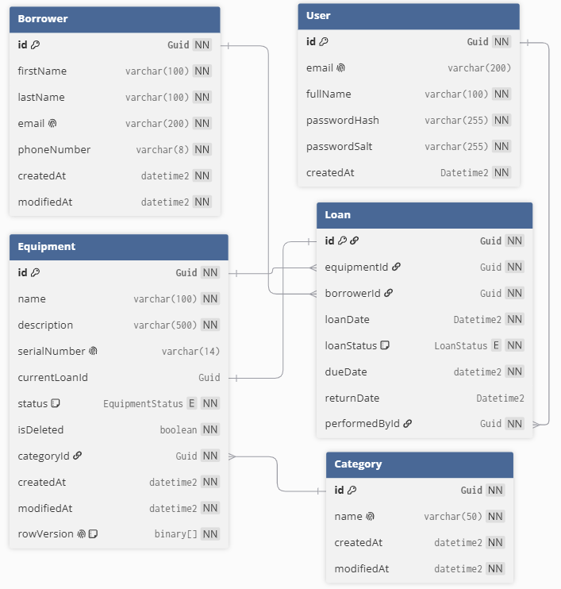

# Fagprøve IKT — tjenesteutviklerfaget — Dokumentasjon av prøvearbeidet

**Kandidat**: Heine Breimo

## Dag 1 (16.06.2026)

### Aktivitet 1 — Oppsett av database diagram

#### Hva ble gjort

- Definerte kravene til tabellene.

- Definerte relasjoner mellom Equipment, Category, Loan, Borrower og
  User for å støtte registrering av utlån, historikk og tilgangsstyring.

- Opprettet tabellene User, Equipment, Category, Borrower og Loan.

#### Hvordan ble arbeidet utført

- Opprettet et nytt «utlånssystem» sitt databasediagram ved hjelp av
  [dbdiagram](https://dbdiagram.io/).

- Opprettet tabellene basert på de funksjonelle kravene i oppgaven.
  Spesielt ble det lagt vekt på kravene til utstyrshåndtering,
  utlånshistorikk og autentisering. Konfigurerte relasjoner mellom
  tabellene i diagrammet ved hjelp av kravene.

- Opprettet spesifikasjoner rundt hver rad i tabellen (nullable, primære
  nøkkel osv.)

#### Dokumentasjon

- Skjermbilde av ER-diagrammet til databasediagrammet finner du på side

##### ER-diagram 

> 

#### Kommentar

Denne aktiviteten ble gjennomført før planleggingsdokumentet ble
utarbeidet og er derfor ikke sammenlignet mot planen.

### Aktivitet 2 — Planleggingsdelen

#### Delaktivitet 2.1 — Teknologiske valg

##### Hva ble gjort

- Definerte hvilke verktøy som skulle benyttes i utviklingsprosessen.

- Valgte programmeringsspråk som skulle brukes til frontend- og
  backendutvikling.

- Valgte relevante rammeverk og biblioteker for å støtte utviklingen av
  løsningen.

- Begrunnet valgene basert på kravene i oppgaven og egen erfaring med
  teknologiene.

##### Hvordan ble arbeidet utført

- Vurderte hvilke verktøy som var nødvendige for å utvikle, teste og
  dokumentere løsningen.

- Sammenlignet aktuelle teknologier opp mot kravene i oppgaven.

- Vurderte egne erfaringer med teknologiene for å sikre effektiv
  utvikling innenfor tidsrammen.

- Valgte teknologier som støtter en tydelig separasjon mellom frontend,
  backend og database.

- Dokumenterte valgene og begrunnelsene i planleggingsdokumentet.

##### Kommentar

Denne delaktiviteten ble gjennomført før planleggingsdokumentet ble
utarbeidet og er derfor ikke sammenlignet mot planen.

##### Tidsestimat

Tid brukt for denne delaktiveten er på rundt 1 time.

#### Delaktivitet 2.2 — Database-design

##### Hva ble gjort

- Presenterte frem databasediagrammet mitt.

- Definerte databaserelasjonene til diagrammet.

- Definerte valgene jeg tok gjennom struktureringen av
  databasediagrammet.

##### Hvordan ble arbeidet utført

- Presenterte databasediagramet mitt som et bilde.

- Definerte databaserelasjoner mellom Equipment, Loan, Category, User og
  Borrower I enkel tekst for lesere som ikke er vant til ER-Diagrammer.

- Definerte database valgene mine med en tabell over valgene og deres
  begrunnelser for hvorfor jeg tok de valgene over andre mer
  standardiserte valg.

##### Kommentar

Denne delaktiviteten inngår i utarbeidelsen av planleggingsdokumentet og
er derfor ikke vurdert opp mot en tidligere plan.

##### Tidsestimat

Tid brukt for denne delaktiveten er på rundt 1 time.

#### Delaktivitet 2.3 — Fremdriftsplanen

##### Hva ble gjort

- Opprettet seksjon for endepunkt, sider og et generelt tidsestimat for
  fremdriftsplanen.

- Opprettet en tabell for endepunkt som inneholder;

  - hvilket endepunkt,

  - beskrivelse,

  - hvordan HTTP-type endepunktet er

  - tidsestimat for det endepunktet.

- Opprettet en tabell for sider som angir sidetall, en beskrivelse og et
  tidsestimat for siden.

##### Hvordan ble arbeidet utført

- Identifiserte hvilke API-endepunkter som var nødvendige for å oppfylle
  kravene i oppgaven.

- Kartla hvilke sider og brukergrensesnitt som var nødvendige basert på
  kravene og valgt løsningsdesign.

- Identifiserte behov for DTO-er, hjelpemetoder og andre
  støttestrukturer som måtte implementeres senere i utviklingsfasen.

- Definerte endepunktene og tidsbruk for sidene.

- Regnet ut fremdriftsplanen sitt tidsestimat.

##### kommentar

Denne delaktiviteten inngår i utarbeidelsen av planleggingsdokumentet og
er derfor ikke vurdert opp mot en tidligere plan.

##### Tidsestimat

Tid brukt for denne delaktiveten er på rundt 2 timer.

#### Delaktivitet 2.4 — Alternativ løsning

##### Hva ble gjort

- Opprettet en innledning som beskriver hensikten med å vurdere
  alternative løsninger.

- Utarbeidet en alternativ løsning der applikasjonen utvikles med Razor
  Pages i stedet for Angular.

- Vurderte hvordan den alternative løsningen ville påvirket
  utviklingsprosessen og den ferdige applikasjonen.

##### Hvordan ble arbeidet utført

- Identifiserte alternative teknologier som kunne oppfylle kravene i
  oppgaven.

- Vurderte hvordan brukergrensesnitt, backend og arbeidsflyt ville blitt
  påvirket av å benytte Razor Pages.

- Sammenlignet fordeler og ulemper ved Razor Pages opp mot Angular.

- Reflekterte over hvordan tidligere erfaringer med Angular påvirket
  teknologivalget.

##### Kommentar

Delaktiviteten ble gjennomført som en del av planleggingsarbeidet og er
derfor ikke vurdert opp mot en tidligere plan.

##### Tidsestimat

Tid brukt for denne delaktiveten er på rundt 30 minutter.

#### Delaktivitet 2.5 — GDPR og behandling av personopplysninger

##### Hva ble gjort

- Vurderte hvordan personopplysninger skulle behandles i applikasjonen.

- Definerte hvilke personopplysninger som er nødvendige å lagre.

- Beskrev formålet med lagringen og hvordan opplysningene brukes i
  systemet.

- Utarbeidet en begrunnelse for hvorfor opplysningene lagres.

##### Hvordan ble arbeidet utført

- Tok utgangspunkt i GDPR-prinsippene om dataminimering og
  formålsbegrensning.

- Identifiserte hvilke data som er nødvendige for autentisering,
  utlånshistorikk og sporbarhet.

- Vurderte hvordan informasjonen kunne lagres på en sikker måte.

- Dokumenterte vurderingene i planleggingsdokumentet.

##### Kommentar

Delaktiviteten ble gjennomført som en del av planleggingsarbeidet og er
derfor ikke vurdert opp mot en tidligere plan.

##### Tidsestimat

Tid brukt for denne delaktiveten er på rundt 1 time.

#### Delaktivitet 2.6 — HMS

##### Hva ble gjort

- Vurderte relevante HMS-tiltak for gjennomføring av fagprøven.

- Identifiserte arbeidsvaner og tiltak som kan redusere risikoen for
  belastningsskader ved langvarig arbeid foran datamaskin.

- Utarbeidet en strategi for å opprettholde et godt arbeidsmiljø gjennom
  prøveperioden.

##### Hvordan ble arbeidet utført

- Tok utgangspunkt i erfaringer fra tidligere utviklingsprosjekter og
  skoleoppgaver.

- Identifiserte faktorer som kan påvirke helse, trivsel og produktivitet
  under utviklingsarbeidet.

- Vurderte tiltak som regelmessige pauser, ergonomisk arbeidsstilling,
  variasjon i arbeidsoppgaver og god planlegging av arbeidsdagen.

- Dokumenterte hvilke HMS-tiltak som skal følges gjennom prøvearbeidet.

##### kommentar

Delaktiviteten ble gjennomført som en del av planleggingsarbeidet og er
derfor ikke vurdert opp mot en tidligere plan.

##### Tidsestimat

Tid brukt for denne delaktiveten er på rundt 4 timer.

#### Delaktivitet 2.7 — Hjelpemidler

##### Hva ble gjort

- Definerte hvilke former av hjelpemidler jeg blir å utnytte gjennom
  dokumentasjon og kode-delen av oppgaven.

- Etablert hvilke typer AI-modeller jeg vil bruke gjennom begge delene
  av oppgaven

- Identifisert bruk av tidligere oppgaver som kan gi meg en ferdigstilt
  Angular applikasjon med kobling til et backend med dotnet og MSSQL,
  andre minifagprøver der jeg har tilgang til simuler logikk og
  komponenter.

##### Hvordan ble arbeidet utført

- Identifiser hvorfor og hvordan jeg blir å bruke disse hjelpemidlene
  på, her brukte jeg mye tid for å reflektere og se gjennom tidligere
  bruk for å skape en realistisk liste over hjelpemidler og hvor dem
  blir implementer/brukt.

- Opprette klare bruke senarioer for hvilken AI-verktøy å modeller som
  blir brukt.

##### kommentar

Denne delaktiviteten inngår i utarbeidelsen av planleggingsdokumentet og
er derfor ikke vurdert opp mot en tidligere plan.

##### Tidsestimat

Tid brukt for denne delaktiveten er på rundt 40 minutter.

#### Delaktivitet 2.8 — Skisser over applikasjonen

##### Hva ble gjort

- Opprettet skisser for applikasjonens sider basert på kravene i
  oppgaven og ønsket UI/UX-design.

- Opprettet skisser for sentrale komponenter som kortvisning av utstyr
  og dialogvinduer for opprettelse, redigering, sletting, utlån og
  innlevering av utstyr.

##### Hvordan ble arbeidet utført

- Identifiserte hvilke sider og komponenter som måtte utvikles for å
  oppfylle kravene i oppgaven.

- Tok utgangspunkt i fremdriftsplanen og erfaringer fra tidligere
  prosjekter og minifagprøver for å utforme en hensiktsmessig struktur.

- Utarbeidet skisser for:

  - Utstyrssiden med filtrering, sortering, listevisning og opprettelse
    av nytt utstyr.

  - Detaljsiden for utstyr med informasjon, historikk og tilgjengelige
    handlinger.

  - Dialogvinduer for opprettelse, redigering, sletting, utlån og
    innlevering av utstyr.

- Benyttet [Excalidraw](https://excalidraw.com/) til å utforme skissene.

#### Sammenligning mot plan 

- **Arbeidet samsvarte med planleggingsdelen:**

- Samtlige komponenter — fra hovedsiden med utstyrsliste til de
  spesifikke dialogene for

  - opprettelse,

  - endring,

  - sletting

  - utlån

- er visuelt utarbeidet i full overensstemmelse med kravene i planen.

- **Logikk og validering ivaretatt:**

  - Skissene reflekterer den planlagte funksjonaliteten med Angular
    FormBuilder.

  - Tydelig merking av obligatoriske felter (\*).

  - bekreftelsestrinnet for sletting.

- **Ingen endringer nødvendig:**

  - Det er et direkte og nøyaktig samsvar mellom de estimerte oppgavene
    og de ferdige skissene, og arbeidet kan fortsette uten justeringer i
    den opprinnelige planen.

#### Tidsestimat

Tid brukt for denne delaktiveten er på rundt 2 timer.

## Dag 2 (17.06.2026)

### Aktivitet 3 — Dotnet angular template

#### Mål

Målet med aktiviteten var å etablere et fungerende utviklingsmiljø og en
prosjektstruktur som kan brukes som grunnlag for videre utvikling av
utlånssystemet.

#### Hva ble gjort

- Opprettet prosjektstrukturen ved hjelp av en ferdig .NET- og
  Angular-mal.

- Konfigurerte backend med nødvendige innstillinger for utvikling og
  kjøring av applikasjonen.

- Opprettet databaseoppsett ved hjelp av Entity Framework Core og
  genererte den første migreringen.

- Implementerte grunnleggende API-funksjonalitet for brukerhåndtering.

- Konfigurerte Angular-prosjektet med nødvendig struktur, ruting og
  kommunikasjon mot backend.

- Opprettet grunnleggende sider for;

  - Innlogging

  - Registrering

  - privat område

  - feilhåndtering.

- La til dokumentasjon og arkitekturillustrasjoner i prosjektet.

#### Hvordan ble arbeidet utført

- Tok utgangspunkt i en etablert .NET- og Angular-mal for å redusere
  oppstartstiden og sikre en konsistent prosjektstruktur.

- Organiserte prosjektet i separate områder for frontend og backend for
  å holde ansvarsområdene adskilt.

- Konfigurerte database og ORM ved hjelp av Entity Framework Core.

- Etablerte kommunikasjon mellom frontend og backend ved hjelp av
  API-tjenester og proxy-konfigurasjon.

- Tilpasset og videreutviklet eksisterende komponenter og sider fra
  malen til prosjektets behov.

- Klargjorde utviklingsmiljøet med nødvendige konfigurasjoner for videre
  utvikling.

#### Resultat

- Et fungerende grunnlag for utvikling av utlånssystemet ble etablert.

- Frontend, backend og database ble koblet sammen og klargjort for
  videre utvikling.

- Grunnleggende autentiserings- og navigasjonsstruktur ble tilgjengelig
  i applikasjonen.

- Prosjektet var klart for implementering av funksjonalitet knyttet til
  utstyr, utlån og historikk.

#### Dokumentasjon

Relevant commit:
[411865b](https://github.com/breimolive/lending-system/commit/411865b087cdb0b37f91fcfd9a695c3c0f4505f5)

#### Sammenligning mot plan

##### Arbeidet samsvarte med planleggingsdelen:

Samtlige struktur og filer ble lagt til etter planen min sin referanse
om bruk av malprosjektet under «hjelpemidler».

##### Logikk og validering ivaretatt:

Alt av logikk og valideringer ble tatt i bruk, denne logikken blir
endret og slette senere i andre aktiviteter, men er en grunnmur for
oppgaven sin start.

##### Tidsestimat

Tid brukt for denne aktiveten er på rundt 30 minutter.

**Delaktivitet 3.1 — Implementering av ny logikk i templaten**

##### Mål

Reorganisere databasens struktur og implementere entitetskonfigurasjoner
og seeding for testdata.

##### Hva ble gjort

- Opprettet seperasjon mellom entitetene og deres konfigurasjoner.

- Opprettet seeding for entitetene slikt at jeg og sensorene kan teste
  funksjonaliteten min.

- Opprettet enheter og konfigurasjon for;

  - Brukere

  - Utstyr

  - Låntakere

  - Kategori

  - lån.

- Implementerte database-seeding-fil for å seede test-dataen min inn i
  databasen.

- Opprettet bruker-, utstyr- og låneservice for å håndtere alt fra enkel
  datainnsamling til mer avansert forretningslogikk.

- Implementerte egendefinerte unntak for;

  - dårlig forespørsel (400)

  - ikke funnet (404)

  - uautorisert (401)

  - konflikt (409)

  - forbudt (403).

- Opprettet en ny EF Core migrering basert på de nye entitetene.

- Implementere utstyr og lånekontrollere.

##### Hvordan ble arbeidet utført

- Definerte databaseoppsettet basert på enheter og konfigurasjonsfiler
  for å forbedre struktur og lesbarhet i prosjektet.

- Etablerte hvordan enheter og konfigurasjon skulle struktureres basert
  på krav og databasepreferanser.

- Opprettet seeding-filer for entitetene, samt en egen fil for å laste
  disse inn i databasen.

- Definerte hvor mange services som var nødvendig basert på antall
  enheter og ønsket oppdeling av logikk. Her valgte jeg én samlet
  brukerservice (for både brukere og låntakere), samt separate services
  for utstyr og lån.

- Etablerte egendefinerte unntak for å gi tydelige feilmeldinger til
  utviklere og brukere som bruker systemet til feilsøking.

- Opprettet en ny migrering via EF Core-migrasjonssteg. -\> [Migrations
  Overview](https://learn.microsoft.com/en-us/ef/core/managing-schemas/migrations/?tabs=dotnet-core-cli).

- Opprettet utstyrs- og lånekontrollere med feilsjekker før man lar dem
  snakke med utstyret og låneservicene.

##### Resultat

- Databasestrukturen ble reorganisert og gjort mer modulær og
  oversiktlig.

- En tydelig separasjon mellom enheter og konfigurasjon ble etablert,
  noe som øker vedlikeholdbarheten.

- Seeding ble implementert, som gjør det mulig å fylle databasen med
  testdata for enklere testing og feilsøking.

- Prosjektet fikk en mer strukturert service-lagdeling som skiller
  forretningslogikk fra datatilgang.

- Bruker-, utstyr- og låneservices ble etablert for å håndtere ulike
  deler av systemets logikk.

- Egendefinerte unntak ble implementert for bedre og mer presis
  feilhåndtering (400, 401, 403, 404, 409). \<

- En ny EF Core-migrering ble opprettet basert på den oppdaterte
  datamodellen.

- Systemet ble totalt sett mer robust, skalerbart og enklere å
  videreutvikle.

- Prosjektet fikk kontrollere for som frontend api-et kan snakke med for
  å kjøre bruker- utstyr- og låneservicene.

##### Dokumentasjon

Implementering av ny logikk i templaten kan du finne som en commit på
lending-repoet.

**Relevante commiter:**

- [6184810](https://github.com/breimolive/lending-system/commit/61848106ae1778ac3c947b91c8bdea1fe7423887)

- [6326708](https://github.com/breimolive/lending-system/commit/6326708284c492754e869870b054b4cf3fd1f1de)

- [F7f4ec0](https://github.com/breimolive/lending-system/commit/f7f4ec097bbd1564145fcb9bff27e739f1826b7f)

- [6cc549b](https://github.com/breimolive/lending-system/commit/6cc549b724bff51f02e7510be906f8b0b71e5ba9)

- [78d4dd3](https://github.com/breimolive/lending-system/commit/78d4dd358ca8b833efa8ceb8a31bba5048363e78)

##### kommentar

Delaktiviteten er delvis dokumentert og kan bli sammenlignet mot
planleggingsdelen min, men er ikke tilstrekkelig for å gjøre en
fullstendig eller presis sammenligning. Derfor har jeg ikke gått for en
sammenligning her.

##### Tidsestimat

Tid brukt for denne delaktiveten er på rundt 2 timer.

#### Delaktivitet 3.2 — Modifisering av templaten

##### Mål

Refaktoriserte databasens struktur, entitetskonfigurasjoner,
seed-dataen, kontrollere og servicene til entitetene.

##### Hva ble gjort

- Endret mappestrukturen i database-delen av backend til å inneholde
  separate mapper for enheter, konfigurasjoner og seed-data.

- Endret DatabaseContext for å inkludere de ny implementerte entitetene
  i applikasjonen.

- Modifiserte bruker-kontrolleren til å bruke nye metoder fra
  service-laget og spesiallagde DTO-er for trygg og kontrollert
  dataoverføring.

- Modifiserte utstyrs-enheten til å inkludere indekser for navn og
  status, som senere brukes til filtrering i applikasjonen.

- Modifiserte lånekontrolleren for å rette opp attributtfeil i
  parameterne i metodene.

- Endret Program-filen til å inkludere database av seeding som en del av
  avhengighetsinjeksjonen.

- Endret utstyrs- og låneservicene, hovedsakelig med fokus på
  forretningslogikk og feilhåndtering.

##### Hvordan ble arbeidet utført

- Mappestrukturen ble endret som en standardisert segmenteringsstrategi
  for bedre klarhet og vedlikeholdbarhet. Database-mappen ble delt i tre
  deler: enheter, konfigurasjoner og seeding-data.

- De nye entitetene ble definert i DatabaseContext for å sikre at de
  blir inkludert ved ny migrering.

- Logikken ble flyttet fra bruker-kontrolleren til service-laget for å
  unngå at forretningslogikk eksponeres i kontrolleren, noe som følger
  standard praksis for separasjon av ansvar.

- Indekser for navn og status ble etablert i utstyrs-konfigurasjonen for
  å gjøre søk og filtrering mer effektive og mindre ressurskrevende.

- Feil i attributter ble rettet i utstyrs- og låneservicene, der blant
  annet feil bruk av \[FromRoute\] i stedet for \[FromBody\] ble
  korrigert. Dette sikrer riktig datainnsamling og reduserer risiko for
  feil ved input-håndtering.

- Program-filen ble oppdatert for å registrere database av seeding som
  en del av dependency injection-oppsettet.

- Metodene for «hent og endre utstyr» i utstyrsservicen ble oppdatert
  for å inkludere nødvendige metadata for riktige spørringer.

- Metodene for «få alle», «få én» og «opprett lån» i låneservicen ble
  oppdatert for å sikre korrekt håndtering av relaterte enheter og
  metadata.

##### Resultat

- Mappestrukturen ble mer modulær og oversiktlig, noe som gir bedre
  vedlikeholdbarhet. Datakonfigurasjon, enheter og seeding ble tydelig
  separert, som forbedrer arkitekturen i prosjektet.

- DatabaseContext ble oppdatert slik at alle nye enheter inngår korrekt
  i databasen ved migrering. Service-laget ble forbedret ved å flytte
  forretningslogikk ut av kontrollerne, noe som gir bedre separasjon av
  ansvar.

- Indekser på utstyr gjør filtrering og søk på navn og status mer
  effektivt.

- Feilhåndtering og input-validering ble forbedret gjennom korrigering
  av feil i kontroller-attributter.

- Seeding er nå integrert i applikasjonsoppstart via Program-filen.

- Utstyrs- og låneservicene ble mer stabile og konsistente etter
  forbedringer i forretningslogikk og spørringer.

##### Dokumentasjon

Endringen av logikk i templaten kan du finne som commiter i
lending-repoet.

**Relevante commiter:**

- [0891d35](https://github.com/breimolive/lending-system/commit/0891d35b70e84cbd030c8b2ba67310797e44ad94#diff-05c642c6202d5a4ba77f9194d9ac3c305e86ce038a0dff5a2903e1c4cb213864)

- [F96dedd](https://github.com/breimolive/lending-system/commit/f96dedd1a3368eae33fd69d98bdf5c7d261ecc4f#diff-871fbbd5e1d7a137910d48854bf3970bc069efa7f1cd9fceb79cf4e58b2c7dc3)

- [C6f4554](https://github.com/breimolive/lending-system/commit/c6f45545d6053a99380f29c7c209db0d03d74faf)

- [78d4dd3](https://github.com/breimolive/lending-system/commit/78d4dd358ca8b833efa8ceb8a31bba5048363e78#diff-444e3a84e329bdcee3060bad60efba166d3ffaefb4989d9533f83e950f1a4540)

- [6326708](https://github.com/breimolive/lending-system/commit/6326708284c492754e869870b054b4cf3fd1f1de)

##### Kommentar

Denne delaktiviteten har ingen fundament til å være en del av
planleggingsprosessen og er derfor ikke vurdert opp mot en tidligere
plan.

##### Tidsestimat

Tid brukt for denne delaktiveten er på rundt 3 timer.

#### Delaktivitet 3.3 — Fjerning av template-elementer

##### Mål

Fjerne komponenter og logikk som ikke er relevant til
utviklingsprosessen av applikasjonen basert på relevanse og kravene
koblet til oppgaven.

##### Hva ble gjort

- Fjernet komponentene for registrering og private områder fra
  malprosjektet.

- Fjernet den beskyttede eksempelkontrolleren fra malprosjektet.

- Fjernet eldre migrering av databasen.

- Oppdaterte rutingen i applikasjonen etter fjerning av disse
  komponentene.

##### Hvordan ble arbeidet utført

- Identifiserte hvilke template-elementer som var med som ikke er
  relevant eller har nytte videre i utviklingsprosessen av
  applikasjonen, Deretter slettet jeg filene og referansene til dem

##### Resultat

- Ryddet opp i komponenter og logikk som ikke er relevant for
  applikasjonen basert på kravene for applikasjonen.

##### Dokumentasjon

Denne delaktiviteten har ingen fundament til å være en del av
planleggingsprosessen og er derfor ikke vurdert opp mot en tidligere
plan.

##### Tidsestimat

Tid brukt for denne delaktiveten er på rundt 20 minutter.

#### Delaktivitet 3.4 — Generiske endringer i applikasjonssystemet

##### Mål

- Ferdigstille Program-filen for utviklingstesting.

- Modifisere NuGet-pakker for å inkludere Polly (retry-system for feil
  og seeding).

- Endre tilkoblingsstreng til databasen fra template-database til en
  egen database basert på DatabaseContext.

##### Hva ble gjort

- Endret oppsettet i kontrollerne for å inkludere
  JSON-formatspesifikasjon for serialisering av enums til lesbar tekst.
  Dette gjør at Swagger viser enum-verdier som tekst i stedet for tall,
  noe som forbedrer lesbarheten under testing.

- Implementerte egendefinerte unntak som en del av dependency injection,
  samt en utvidelsesmetode i ASP.NET Core for å støtte disse.
  AddProblemDetails() ble brukt for standardiserte feilmeldinger og
  HTTP-responser.

- Implementerte sentrale services for dependency injection (utstyr-,
  lån- og brukerservice).

- Modifiserte database-seeding-logikken slik at DatabaseContextSeed
  kjøres og fyller databasen med testdata.

- Implementerte UseExceptionHandler, en sentral
  feilhåndteringsmiddleware i ASP.NET Core som fanger opp uventede feil,
  logger dem og returnerer brukervennlige feilmeldinger.

- Installerte Polly via NuGet, noe som oppdaterte prosjektfilen med
  nødvendig package reference for retry-logikk.

- Endret tilkoblingsstreng til databasen ved å erstatte
  template-databasen med en egen database basert på DatabaseContext.

##### Hvordan ble arbeidet utført

- Identifiserte nødvendige dependency injections for at hele
  applikasjonen skulle fungere korrekt både i frontend og backend.

- Implementerte disse avhengighetene og støttefunksjonene slik at de er
  kompatible med resten av applikasjonens arkitektur.

- NuGet-installasjonene oppdaterer automatisk prosjektfilen med
  nødvendige referanser.

- Tilkoblingsstrengen ble endret ved å oppdatere database-navnet i
  ConnectionString, uten å endre resten av konfigurasjonen.

##### Resultat

- Program-filen ble ferdigstilt og fungerer nå for utvikling og testing.

- Polly ble integrert, noe som gir bedre robusthet gjennom
  retry-mekanisme ved feil.

- Swagger viser nå enum-verdier som lesbar tekst, som forbedrer
  utvikleropplevelsen.

- Standardisert feilhåndtering ble implementert gjennom
  AddProblemDetails() og UseExceptionHandler.

- Dependency injection ble utvidet og stabilisert for kjerne-services
  (bruker, utstyr og lån).

- Database av seeding fungerer korrekt ved oppstart og fyller databasen
  med testdata.

- Tilkoblingen til databasen peker nå mot riktig database basert på
  DatabaseContext.

- har fått en mer robust, konsistent og produksjons nære konfigurasjon.

##### Dokumentasjon

De nye generiske endringene i applikasjonssystemet kan du finne som
commiter i lending-repoet.

**Relevant commit:**

[753f58c](https://github.com/breimolive/lending-system/commit/753f58ca517944d7abb958789ea3bae10e3bcf16)

##### Tidsestimat

Tid brukt for denne delaktiveten er på rundt 30 minutter.

## Dag 3 (18.06.2026)

### Aktivitet 4 — Refaktorering av applikasjon (del 1)

#### Delaktivitet 4.1 — Implementering av ny logikk

##### Mål

Målet med denne aktiviteten var å etablere grunnleggende funksjonalitet
i både backend og frontend for å støtte videre utvikling av
utlånssystemet.

##### Hva ble gjort

- Implementerte BorrowerCreateDto for å sikre trygg og kontrollert
  opprettelse av låntakere gjennom API-et.

- Implementerte EquipmentQueriedDto for å kunne returnere utstyr sammen
  med nødvendig informasjon for paginering og filtrering.

- Implementerte en sentral API-tjeneste i klientapplikasjonen for
  kommunikasjon mellom frontend og backend.

- Implementerte en navigasjonslinje (Navbar) for enkel navigering mellom
  applikasjonens sider.

- Implementerte utstyrsmodulen (Equipments) som grunnlag for visning og
  håndtering av utstyr.

- Implementerte utstyr Header for å presentere relevant informasjon og
  funksjonalitet knyttet til utstyrsoversikten.

- Implementerte Index-siden som inngangspunkt til applikasjonen.

- Implementerte utstyr-siden for visning og administrasjon av utstyr.

- Implementerte metoder for henting av kategorier i utstyrstjenesten

##### Hvordan ble arbeidet utført

- Identifiserte behovet for bedre kontroll over opprettelse av
  låntakere. Derfor opprettet jeg en DTO som inneholder kun nødvendig
  informasjon for opprettelse av en ny låntaker. DTO-en legger også til
  rette for validering av innkommende data.

- Opprettet en DTO for paginering av utstyr. Denne inneholder: En liste
  med utstyr. Antall utstyr som vises per side. Hvilken side brukeren
  befinner seg på. Totalt antall sider basert på antall utstyr og antall
  utstyr per side.

- Opprettet en sentral API-tjeneste i klientapplikasjonen ved hjelp av
  Angular sin HttpClient, som brukes til å sende HTTP-forespørsler
  mellom frontend og backend.

- Opprettet en navigasjonskomponent som benytter en egendefinert
  brukerservice for å holde oversikt over innlogget bruker. Angular sitt
  router-system brukes også til å håndtere utlogging og videresending
  til innloggingssiden.

- Opprettet en komponent for utstyrsoversikten som viser alt utstyr og
  tilhørende informasjon. Komponenten inkluderer funksjonalitet for
  filtrering, sortering, søk og opprettelse av nytt utstyr.

- Opprettet en komponent for visning av enkeltutstyr, der brukeren kan
  endre, låne ut, levere tilbake eller slette utstyr.

- Opprettet en komponent for detaljvisning av utstyr som presenterer
  generell informasjon og lånehistorikk.

- Opprettet en indekskomponent som samler navigasjonslinjen og resten av
  applikasjonens innhold ved hjelp av Angular sin router-outlet, som
  fungerer som en dynamisk plassholder for sidene i applikasjonen.

- Opprettet en ny metode som ser etter alle kategorier som ligger i
  databasen og sender dem ut som en liste av kategori DTO-er.

##### Resultat

- Grunnleggende backend- og frontend-funksjonalitet for utlånssystemet
  ble etablert.

- Opprettelse av låntakere ble sikrere og mer kontrollert gjennom bruk
  av DTO-er.

- Paginering av utstyr ble implementert og muliggjør effektiv håndtering
  av større datamengder.

- Kommunikasjonen mellom frontend og backend ble sentralisert gjennom en
  felles API-tjeneste. Navigasjon mellom applikasjonens sider ble
  implementert gjennom en egen navigasjonslinje.

- Utstyrsmodulen ble etablert med støtte for visning, søk, filtrering og
  sortering av utstyr. Det ble utviklet egne sider for både
  utstyrsoversikt og detaljvisning av enkeltutstyr.

- Grunnlaget for videre utvikling av utlåns-, administrasjons- og
  brukerfunksjonalitet ble etablert i frontend-applikasjonen.

- Metode for å hente ut kategorier som vi kan gjenbruke igjennom
  applikasjon ved oppretting og endring av utstyr.

##### Sammenligning mot plan 

######  Arbeidet samsvarte med planleggingsdelen:

I planleggingsdelen går jeg dypere inn på hvordan sidene skal se ut og
hvilke komponenter de skal inneholde. Her følger jeg planen min på side
5 der jeg snakker om sidene «Utstyrsliste» og «Spesifikt utstyr». Her
går jeg i detalj på hva slags funksjonalitet sidene skal ha og hvordan
jeg vil løse det. Dette ser man også senere i skissene over
applikasjonen på side 11-12.

###### Logikk og validering ivaretatt:

Alt av logikk og validering er ivaretatt. Det er noen endringer innenfor
designvalg, men alt av logikk er slik jeg har planlagt at det skulle
være.

Disse nye implementeringene kan du finne som commiter på lending-repoet.

**Relevante commiter:**

- [021c5c8](https://github.com/breimolive/lending-system/commit/021c5c8cc6fe178e3ba5611595216f3ea4f154bc)

- [574625f](https://github.com/breimolive/lending-system/commit/574625f600d6fdebeff70882c9e6e682b88a887e)

- [Cb503db](https://github.com/breimolive/lending-system/commit/cb503dbac69c3f9e3bdb2839159fb948f5796c1b)

- [Ebf4d75](https://github.com/breimolive/lending-system/commit/ebf4d75f6dbc64fca9b79d2b4692e7ba60688a5c)

- [221da11](https://github.com/breimolive/lending-system/commit/221da11561e8b1fd6f46f8d775f1e59194d9cf13)

- [E532f9f](https://github.com/breimolive/lending-system/commit/e532f9fed4fbfed31cfde70e8d31c9096f6b92b1)

- [3d6e0d6](https://github.com/breimolive/lending-system/commit/3d6e0d66466b8e7d13edc802e1f93e14185c4f3a)

##### Tidsestimat

Tid brukt for denne delaktiveten er på rundt 5 timer.

#### Delaktivitet 4.2 — Modifisering av logikk

##### Mål

Målet med denne aktiviteten var å videreutvikle utlånssystemet ved å
forbedre eksisterende funksjonalitet i både backend og frontend.
Arbeidet fokuserte på å utvide støtte for utlån og låntakere, forbedre
databehandling og paginering, samt videreutvikle brukergrensesnittet.

##### Hva ble gjort

- Modifiserte DTO-en for uthenting av utstyr for å forbedre støtte for
  paginering og presentasjon i brukergrensesnittet.

- Oppdaterte bruker-DTO-en ved å gjøre feltene «fullt navn» og «e-post»
  obligatoriske.

- Modifiserte brukerkontrolleren for å legge til et nytt endepunkt som
  kan opprette låntakere.

- Modifiserte lånekontrolleren for å inkludere et kategoriendepunkt som
  kan hente alle kategorier for utstyret.

- Implementerte logikk for opprettelse av nye låntakere i
  brukerservicen.

- Oppdaterte metoden for uthenting av alt utstyr slik at den støtter
  paginering og filtrering på låntakere.

- Modifiserte metoden for opprettelse av lån i låneservicen slik at
  utstyrets status automatisk oppdateres til «utlånt» når et lån
  opprettes.

- Oppdaterte utstyrsenheten og DTO-logikken slik at nåværende lån
  inkluderes i responsen.

- Oppdaterte seeding-logikken for utstyr basert på endringer i
  utstyrsenheten.

- Oppdaterte låneenheten og DTO-logikken slik at informasjon om
  tilknyttet utstyr inkluderes.

- Modifiserte innloggingskomponenten fra templaten slik at den samsvarer
  med skissene, håndterer validering bedre og kommuniserer med
  CurrentUserService for å holde oversikt over innlogget bruker.

- Oppdaterte utstyrsoversikten med forbedret detaljvisning og støtte for
  paginering.

- Videreutviklet siden for enkeltutstyr slik at den viser detaljert
  informasjon om utstyret og dets lånehistorikk.

##### Resultat

- Datavalidering og dataoverføring mellom frontend og backend ble
  forbedret gjennom oppdaterte DTO-er.

- Systemet støtter nå opprettelse og administrasjon av låntakere gjennom
  egne API-endepunkter.

- Utstyrsoversikten fikk støtte for paginering og filtrering, noe som
  forbedrer brukeropplevelsen og skalerbarheten.

- Relasjonene mellom utstyr og utlån håndteres mer korrekt og konsistent
  i systemet.

- Opprettelse av lån oppdaterer automatisk utstyrets status, noe som
  reduserer risikoen for inkonsistente data.

- Seed-data og datamodeller ble oppdatert for å støtte den nye
  funksjonaliteten.

- Innloggingsløsningen ble forbedret med bedre validering og håndtering
  av innlogget bruker

- Utstyrsoversikten og detaljsidene ble mer funksjonelle og informative
  for brukeren.

- Løsningen ble mer robust, vedlikeholdbar og bedre tilpasset videre
  utvikling av utlånssystemet.

##### Dokumentasjon

Disse modifiseringer kan du finne som commiter på lending-repoet.

**Relevante commiter:**

- [F87e770](https://github.com/breimolive/lending-system/commit/f87e7706d765889d5e1f298ba1e7e5f96987d4f5)

- [963d5e9](https://github.com/breimolive/lending-system/commit/963d5e90944c1eb9d53c9eae27a109784874636c)

- [F6e032e](https://github.com/breimolive/lending-system/commit/f6e032e85ab130a405ca45bedadec5c7de67376a)

- [398b867](https://github.com/breimolive/lending-system/commit/398b867f2c42da818148f54eac67e0b58e2c5713)

- [B2e80ce](https://github.com/breimolive/lending-system/commit/b2e80ceaee10cd1f680e00ff80b23797b979ac65)

- [28a8188](https://github.com/breimolive/lending-system/commit/28a8188a8ce5186924691777950892658b636ad0)

- [E201d3f](https://github.com/breimolive/lending-system/commit/e201d3fac66ac85f1be7b3e34d456c138baf3f4a)

##### Tidsestimat

Tid brukt for denne delaktiveten er på rundt 5 timer.

#### Delaktivitet 4.3 — Generelle endringer i applikasjonssystemet

##### Mål

Målet med denne aktiviteten var å etablere et solid grunnlag for
frontend-applikasjonen ved å forbedre applikasjonens struktur,
navigasjon, autentisering og visuelle utforming. Arbeidet fokuserte på å
gjøre løsningen mer vedlikeholdbar, standardisert og skalerbar for
videre utvikling.

##### Hva ble gjort

- Refaktorerte applikasjonens routing.

- Implementerte CurrentUserService.

- Migrerte frontend til Angulars standalone-arkitektur.

- Opprettet ApplicationConfig.

- Implementerte global styling.

- Integrerte Geist-fonten.

- Oppdaterte App Component til å fungere som applikasjonens wrapper.

##### Hvordan ble arbeidet utført

- Identifiserte behov for endringer i applikasjonens struktur og
  oppsett. Routing-løsningen ble derfor refaktorert til å benytte
  CurrentUserService og dens route guard i stedet for den tidligere
  løsningen. Samtidig ble rutingen oppdatert til å følge Angulars
  anbefalte prinsipper for lasting og visning av komponenter.

- CurrentUserService ble opprettet for å kontrollere hvilke ruter
  brukeren har tilgang til, samt holde oversikt over innlogget bruker
  gjennom hele applikasjonen. Denne informasjonen benyttes blant annet i
  navigasjonslinjen.

- Navbar-komponenten og Router Outlet ble importert til AppComponent og
  plassert i en felles container. Containeren ble stylet med Flexbox,
  flex-direction: column og gap for å skape en mer strukturert
  sideoppbygning.

- Opprettet en Angular ApplicationConfig for å konfigurere ruting,
  HTTP-kommunikasjon og ytelsesoptimalisering. Dette erstattet bruken av
  platformBrowserDynamic, som ikke lenger er den anbefalte løsningen for
  moderne Angular-applikasjoner basert på standalone-komponenter.

- Integrerte en global stilfil som inneholder forhåndsdefinerte
  variabler for blant annet farger, spacing og andre gjenbrukbare
  designelementer.

- Integrerte Geist-fonten som standard skrifttype i applikasjonen for å
  sikre et konsistent og moderne visuelt uttrykk.

- Applikasjonen ble migrert til Angulars standalone-arkitektur ved hjelp
  av ApplicationConfig. Dette gir et enklere og mer moderne oppsett uten
  behov for tradisjonelle Angular-moduler.

##### Resultat

- Applikasjonen ble migrert til Angulars moderne standalone-arkitektur,
  noe som reduserte kompleksiteten i oppsettet og gjorde løsningen
  enklere å vedlikeholde.

- Routing-systemet ble forbedret ved å benytte CurrentUserService og
  route guards for å kontrollere tilgang til beskyttede sider.

- Applikasjonen fikk en sentral brukerhåndtering som gjør det mulig å
  holde oversikt over innlogget bruker på tvers av komponenter.

- AppComponent fungerer nå som en felles wrapper for applikasjonen og
  sørger for en mer konsistent oppbygning av brukergrensesnittet.

- ApplicationConfig ble implementert for å konfigurere ruting,
  HTTP-klient og andre globale tjenester på en moderne måte.

- En felles stilprofil ble etablert gjennom globale CSS-variabler og
  gjenbrukbare designverdier.

- Geist-fonten ble integrert som standard skrifttype for å gi et mer
  konsistent visuelt uttrykk.

- Endringene la et bedre grunnlag for videre utvikling av
  frontend-applikasjonen og gjorde kodebasen mer strukturert,
  vedlikeholdbar og skalerbar.

##### Dokumentasjon

De nye generiske endringene i applikasjonssystemet kan du finne som
commiter i lending-repoet.

**Relevante commiter:**

- [3745aa8](https://github.com/breimolive/lending-system/commit/3745aa800e9b7522a8dfc2b382ff869714ffdbde)

- [11ff653](https://github.com/breimolive/lending-system/commit/11ff6535eafdbdbd25eaf6c9228c555359c98ec8)

##### Tidsestimat

Tid brukt for denne delaktiveten er på rundt 1 time.

## Dag 4 (19.06.2026)

### Aktivitet 5 — Refaktorering av applikasjon (del 2)

#### Delaktivitet 5.1 — Implementering av dialogvinduer for utstyr og utlån

##### Mål

Målet med denne aktiviteten var å implementere de sentrale
dialogvinduene som brukeren benytter for å administrere utstyr og utlån
i systemet. Arbeidet fokuserte på å gjøre de viktigste arbeidsprosessene
tilgjengelige gjennom et intuitivt og brukervennlig grensesnitt.

##### Hva ble gjort

- Implementere et dialogvindu for opprettelse av nytt utstyr, slik at
  brukere kan registrere nytt utstyr i systemet.

- Implementere et dialogvindu for redigering av eksisterende utstyr,
  slik at informasjon kan oppdateres ved behov.

- Implementere et dialogvindu for sletting av utstyr, inkludert
  bekreftelse før handlingen utføres.

- Implementere et dialogvindu for utlån av utstyr, slik at brukere kan
  registrere nye utlån og knytte utstyr til en låntaker.

- Implementere et dialogvindu for innlevering av utstyr, slik at aktive
  utlån kan avsluttes og utstyrets status oppdateres.

- Sikre at dialogvinduene kommuniserer med backend-API-et og håndterer
  validering, brukerinteraksjon og oppdatering av data på en konsistent
  måte.

- Etablere en enhetlig brukeropplevelse ved å benytte samme
  designprinsipper og arbeidsflyt på tvers av alle dialogvinduene.

##### Hvordan ble arbeidet utført

- Opprettet et dialogvindu for registrering av nytt utstyr. Dette
  dialogvinduet ble utformet med tanke på gjenbruk, slik at samme
  struktur kunne benyttes i flere av de øvrige dialogvinduene.

- Utviklet et skjema for opprettelse av utstyr som inneholder alle
  nødvendige felter definert i kravspesifikasjonen. Skjemaet ble også
  utformet for å kunne gjenbrukes i de øvrige dialogvinduene der det var
  hensiktsmessig.

- Opprettet dialogvinduer for redigering av utstyr, sletting av utstyr,
  utlån og innlevering ved å ta utgangspunkt i opprettelsesdialogen og
  tilpasse den til den aktuelle funksjonaliteten.

- Implementerte dedikerte API-kall i frontendens API-tjeneste for hver
  av dialogene. Disse benytter DTO-ene som ble utviklet i aktivitet 4,
  delaktivitet 4.1, for å sikre korrekt dataoverføring mellom frontend
  og backend.

- Benyttet etablerte designprinsipper og arbeidsflyt fra tidligere
  prosjekter for å sikre en enhetlig brukeropplevelse og effektivisere
  utviklingsprosessen.

- Testet dialogvinduene fortløpende for å verifisere at validering,
  brukerinteraksjon og kommunikasjon med backend fungerte som forventet.

##### Resultat

- Det ble implementert dialogvinduer for opprettelse, redigering og
  sletting av utstyr, slik at brukeren kan administrere utstyr direkte
  fra brukergrensesnittet.

- Det ble implementert dialogvinduer for utlån og innlevering av utstyr,
  som gjør det mulig å registrere og avslutte utlån på en strukturert
  måte.

- Dialogvinduene benytter en felles struktur og et enhetlig design, noe
  som gir en konsistent brukeropplevelse gjennom hele applikasjonen.

- Gjenbruk av komponenter og skjemaer reduserte mengden duplisert kode
  og gjorde videre utvikling og vedlikehold enklere.

- Dialogvinduene ble koblet mot backend-API-et gjennom dedikerte
  endepunkter i frontendens API-tjeneste, slik at data kan opprettes,
  oppdateres og slettes direkte fra brukergrensesnittet.

- Validering av brukerinput ble implementert for å sikre at nødvendige
  data er fylt inn før forespørsler sendes til backend.

- Funksjonaliteten for administrasjon av utstyr og utlån ble fullført i
  henhold til kravene og danner grunnlaget for videre testing og
  ferdigstillelse av applikasjonen.

##### Kommentar

Disse modifiseringer kan du finne som commiter på lending-repoet.

**Relevante commiter:**

- [24b5f9a](https://github.com/breimolive/lending-system/commit/24b5f9ac340954eb3e2ddd04c4f35cdce9c261cd)

- [Fa97868](https://github.com/breimolive/lending-system/commit/fa97868276d68a6c0993f3c3aa39edb777f8e7bd)

- [35767b9](https://github.com/breimolive/lending-system/commit/35767b9bd9144c751832058c20a314a88dceb3e2)

- [834f1a1](https://github.com/breimolive/lending-system/commit/834f1a1c40fe32df5a25073534bb0dc0987b677b)

##### Tidsestimat

Tid brukt for denne delaktiveten er på rundt 4 timer.

#### Delaktivitet 5.2 — Modifisering av logikk

##### Mål

Målet med denne aktiviteten var å videreutvikle utlånsfunksjonaliteten
og forbedre samspillet mellom frontend, backend og database. Arbeidet
fokuserte på å gjøre registrering av utlån mer brukervennlig, styrke
datavalideringen og sikre at nødvendig informasjon om låntakere følger
med gjennom hele systemet.

##### Hva ble gjort

- Videreutviklet logikken for utlån og innlevering av utstyr. Knappene
  for utlån og innlevering vises nå kun når handlingen er tilgjengelig.
  For å kunne levere inn utstyr må utstyret være utlånt og brukeren må
  være den samme som registrerte utlånet.

- Implementerte søk etter eksisterende låntakere basert på
  e-postadresse. Når brukeren skriver inn en e-postadresse i
  utlånsdialogen, sendes et søk mot databasen for å undersøke om
  låntakeren allerede eksisterer.

- Dersom en eksisterende låntaker blir funnet, deaktiveres feltene for
  fornavn, etternavn og telefonnummer. Brukeren kan da kun endre
  e-postadressen eller benytte den eksisterende låntakeren.

- For å redusere unødvendige forespørsler ble det implementert debounce
  på søkefeltet. Før API-kallet utføres kontrolleres det at
  e-postadressen er gyldig og at samme søk ikke allerede finnes i
  klientens cache.

- API-kallet ble implementert ved hjelp av RxJS og switchMap. Når en
  låntaker blir funnet, oppdateres skjemaet automatisk ved å patche inn
  informasjonen som er hentet fra databasen.

- Opprettet flere seedede utstyrsenheter i databasen for å gjøre testing
  av funksjonalitet enklere og mer effektiv.

- Gjennomgikk valideringslogikken i datamodellene og identifiserte flere
  områder hvor valideringen kunne forbedres. Dette ble løst gjennom
  justeringer i konstruktører og tilhørende valideringsregler.

- Modifiserte bruker-, utlåns- og utstyrstjenestene slik at nødvendige
  relasjoner og DTO-er inkluderes i spørringene. For eksempel hentes nå
  låntakerinformasjon gjennom utlånet når utstyrsdata lastes inn.

- Under testing ble det oppdaget at søk etter låntakere ikke håndterte
  todelte navn korrekt. Søkelogikken ble derfor refaktorert slik at både
  fornavn, etternavn og kombinasjoner av disse håndteres mer presist.

- Oppdaterte prosjektets README med informasjon om installasjon, bruk og
  innlogging. Samtidig ble prosjektets ikon erstattet og HTML-tittelen
  oppdatert for å gi applikasjonen en mer profesjonell presentasjon.

- Gjennomførte ytterligere testing av funksjonalitet og
  brukergrensesnitt for å verifisere at kravene i oppgaven var oppfylt.

##### Resultat

- Utlånsprosessen ble forbedret ved at eksisterende låntakere automatisk
  kan identifiseres ved hjelp av e-postadresse.

- Brukeropplevelsen ved registrering av utlån ble forbedret gjennom
  automatisk utfylling av låntakerinformasjon og redusert behov for
  manuell registrering.

- Valideringen i systemet ble styrket, noe som reduserer risikoen for
  ugyldige data og feilregistreringer.

- Tjenestelagene og DTO-ene ble oppdatert slik at nødvendig informasjon
  om utlån og låntakere er tilgjengelig i hele applikasjonen.

- Søkefunksjonaliteten for låntakere ble forbedret og håndterer nå både
  enkle og sammensatte navn på en mer robust måte.

- Datagrunnlaget for testing ble utvidet gjennom flere seedede
  utstyrsenheter, noe som gjorde det enklere å verifisere funksjonalitet
  og oppdage feil.

- Dokumentasjonen og den visuelle presentasjonen av prosjektet ble
  forbedret gjennom oppdatering av README, applikasjonsikon og
  nettstedstittel.

- Aktiviteten bidro til å gjøre utlånssystemet mer brukervennlig, robust
  og tilpasset kravene i oppgaven.

##### Kommentar

Disse modifiseringer kan du finne som commiter på lending-repoet.

**Relevante commiter:**

- [3fcdf66](https://github.com/breimolive/lending-system/commit/3fcdf66c3399464482032634e3eb9c18f4df8227)

- [6d2aa0c](https://github.com/breimolive/lending-system/commit/6d2aa0cc71681391fa74ee3d2f4005c752f69c73#diff-03271c36f4b0c0470c9b342ca683efb11a2745755c9aad897581009d0db35e0b)

- [21c4ff1](https://github.com/breimolive/lending-system/commit/21c4ff1859e5ab19a9f9e377e1f19f85b3d65fb4)

- [71ff010](https://github.com/breimolive/lending-system/commit/71ff0100efb17c21d06a5e7564fac82552f7cf3b)

- [E2e7179](https://github.com/breimolive/lending-system/commit/e2e7179da858df92b9f3b3fe3ae5048905d256ac)

- [Ef32d46](https://github.com/breimolive/lending-system/commit/ef32d464e974123cbbfdf59d23a18845677fde3d)

- [84a9eba](https://github.com/breimolive/lending-system/commit/ef32d464e974123cbbfdf59d23a18845677fde3d)

- [016a2d7](https://github.com/breimolive/lending-system/commit/016a2d727603df42252c8fbd659f58b3ec2cd4af)

##### Tidsestimat

Tid brukt for denne delaktiveten er på rundt 6 timer.

#### Delaktivitet 5.3 — Generisk endringer i applikasjonssystemet

##### Mål

Målet med denne aktiviteten var å videreutvikle og forbedre eksisterende
funksjonalitet gjennom refaktorering, bedre datavalidering og
standardisering av brukergrensesnittet. Arbeidet fokuserte på å forenkle
arbeidsflyter, sikre mer konsistent datahåndtering og forbedre
vedlikeholdbarheten i løsningen.

##### Hva ble gjort

- Forbedre utlåns- og utstyrsmodellen ved å inkludere nødvendig
  informasjon om låntakere der dette er relevant.

- Begrense hvilke felter brukeren kan påvirke direkte ved opprettelse av
  utstyr og utlån, slik at forretningsregler håndheves av systemet.

- Videreutvikle DTO-er for å støtte den oppdaterte utlånslogikken og
  sikre en mer konsistent dataflyt mellom frontend og backend.

- Refaktorere eksisterende kode for å benytte tydeligere og mer
  beskrivende metodenavn.

- Utvide frontendens API-tjeneste med støtte for oppslag av låntakere
  basert på e-postadresse.

- Standardisere utformingen av dialogvinduer gjennom etablering av
  felles stilregler og gjenbrukbar styling.

- Videreutvikle applikasjonens visuelle uttrykk ved å justere globale
  designverdier og forbedre kontrast og lesbarhet.

- Forbedre kodekvaliteten og vedlikeholdbarheten ved å redusere teknisk
  gjeld og tilpasse løsningen til tidligere implementerte endringer.

##### Hvordan ble arbeidet utført

- Fjernet statusfeltet fra DTO-en for opprettelse av utstyr i frontend.
  Denne endringen ble tidligere gjennomført i backend som en del av
  [delaktivitet 5.2](#delaktivitet-5.2-modifisering-av-logikk), og ble
  nå ferdigstilt i frontendens API-tjeneste. Dette gjør at brukere ikke
  kan angi status ved opprettelse av utstyr, noe som bidrar til å
  håndheve systemets forretningsregler og redusere risikoen for ugyldige
  data.

- Implementerte låntakerinformasjon i LoanDto-en i frontend. Denne
  endringen ble tidligere gjennomført i backend som en del av
  [delaktivitet 5.2](#delaktivitet-5.2-modifisering-av-logikk), og ble
  nå ferdigstilt i frontend for å sikre at nødvendig informasjon om
  låntakeren er tilgjengelig ved håndtering av utlån.

- Fjernet lånestatus fra DTO-en for opprettelse av utlån i frontend.
  Endringen ble gjennomført for å hindre at brukere kan sette status
  direkte ved opprettelse av et utlån. Status skal i stedet håndteres av
  systemets forretningslogikk.

- Refaktoriserte utstyrsrelaterte metoder i frontendens API-tjeneste.
  Metoder med generiske eller misvisende navn ble erstattet med mer
  beskrivende navn, slik som updateEquipment og deleteEquipment. Dette
  bidrar til bedre lesbarhet og vedlikeholdbarhet i kodebasen.

- Implementerte et nytt endepunkt i API-tjenesten for oppslag av
  låntakere basert på e-postadresse. Endepunktet følger samme struktur
  og prinsipper som de øvrige API-kallene i applikasjonen.

- Flyttet og samlet CSS-regler for dialogvinduer i en egen global
  dialogstilfil. Dette gjør det enklere å gjenbruke styling og sikrer et
  mer konsistent design på tvers av applikasjonen.

- Modifiserte den globale stilfilen ved å gjøre bakgrunnsfargen for
  tilgjengelig utstyr noe mørkere. Endringen ble gjennomført for å
  forbedre kontrasten og gjøre statusindikatorene lettere å oppfatte for
  brukeren.

##### Resultat

- Frontendens DTO-er ble oppdatert til å samsvare med endringene som
  tidligere ble gjennomført i backend, noe som sikret en konsistent
  dataflyt mellom klient og server.

- Brukere kan ikke lenger angi status ved opprettelse av utstyr eller
  utlån. Dette bidrar til å håndheve forretningsreglene i systemet og
  reduserer risikoen for ugyldige data.

- Låntakerinformasjon ble inkludert i utlånsmodellen, slik at frontend
  har tilgang til nødvendig informasjon om tilknyttede låntakere uten
  ekstra databehandling.

- API-tjenesten i frontend ble utvidet med støtte for oppslag av
  låntakere via e-postadresse, noe som legger grunnlaget for en mer
  effektiv utlånsprosess.

- Metodenavn i API-tjenesten ble standardisert og gjort mer beskrivende,
  noe som forbedrer lesbarheten og vedlikeholdbarheten i kodebasen.

- Dialogvinduene benytter nå en felles CSS-fil, som gir et mer
  konsistent design og reduserer duplisert kode.

- Den globale stilprofilen ble justert ved å mørkne bakgrunnsfargen for
  tilgjengelig utstyr, noe som forbedrer kontrast og synlighet i
  brukergrensesnittet.

- Aktiviteten bidro til å forbedre kodekvaliteten, standardisere
  brukergrensesnittet og ferdigstille frontend-endringer som var
  nødvendige for å støtte den oppdaterte utlånsfunksjonaliteten.

##### Kommentar

Disse endringen kan du finne som en commit på lending-repoet.

**Relevant commit:**

- [A674cd4](https://github.com/breimolive/lending-system/commit/a674cd45a6b26998a6ce136a26177e23cec5e654#diff-dc18695f91a9229cb3e30eb9b131c9b4cae6d53cc89c254f5c4a9b8614d665d4)

##### Tidsestimat

Tid brukt for denne delaktiveten er på rundt 1 time.
